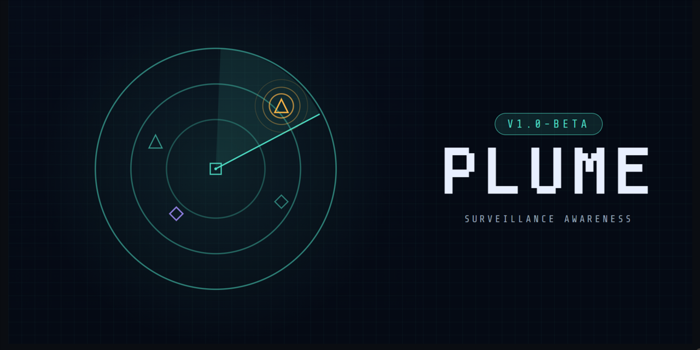

# Plume — M5Cardputer ADV Edition

Passive RF scanner that detects Flock Safety ALPR cameras and Raven surveillance devices using WiFi promiscuous mode and Bluetooth Low Energy scanning. Runs on the M5Cardputer ADV (ESP32-S3) with a 240×135 color LCD, full QWERTY keyboard, GPS, and SD card logging.

🔒 No network connection required. No cloud. Everything runs locally on the device. The device operates in a purely passive mode — it receives publicly broadcast RF signals but never transmits, connects to, or interacts with any detected device.

---

## 🛠 Hardware

- **M5Cardputer ADV** (ESP32-S3, no PSRAM variant supported)
- **GPS module** connected via UART (pins 15/13, 115200 baud) — NEO-6M, BN-220, or similar
- **MicroSD card** (FAT32, any size) — for detection logs, packet captures, and stats

## ⚡ Flashing

1. Install the Arduino IDE with ESP32-S3 board support
2. Install libraries: `M5Cardputer`, `NimBLE-Arduino`, `TinyGPSPlus`
3. Set board to `M5Cardputer` (or `ESP32-S3 Dev Module` with USB CDC enabled)
4. Set partition scheme to include SPIFFS/LittleFS
5. Flash via USB-C

WiFi credentials for export mode are configured on-device via Menu → WiFi Config. No need to edit the source code.

## 🚀 Quick Start

Power on. The boot screen shows initialization progress, then an animated title card appears briefly before dissolving into the scanner screen. The device immediately begins scanning WiFi and BLE channels for known Flock/Raven signatures.

When a detection occurs:
- 🔊 An audible alarm plays (ascending tones for WiFi, descending for BLE — pitch pattern indicates confidence level)
- 💡 The LED flashes the protocol color for 15 seconds
- 📋 A toast notification appears with the device name and confidence percentage
- 💾 The detection is logged to the SD card with GPS coordinates, signal strength, and detection method

Navigate between screens using `,` (left) and `/` (right). Press `m` to open the menu. Press `Tab` for a context-sensitive help overlay on any screen.

---

## 📺 Screens

### 1️⃣ Scanner

The main operating screen. Split into two panels with a vertical divider.

**Left panel** cycles through three visualizations (press `v` to cycle):
- **SCAN** — Proximity radar with phosphor sweep. Devices appear as icons (triangles = WiFi, diamonds = BLE) positioned by signal strength. Flock detections pulse in amber with a filled shape. Icons fade through three phases as devices age: full opacity → smooth fade → flicker → gone. A sweep glow illuminates icons as it passes.
- **LINE** — 13-channel WiFi spectrum curve with Catmull-Rom smoothing. A scan line with trailing wake tracks the current hopping channel. The curve shifts toward purple when BLE is actively scanning. Diagonal hatch texture fills the background. Channel labels mark 1, 6, 11, and 13.
- **TIME** — 5-minute layered isometric timeline showing WiFi (teal) and BLE (purple) activity as 3D ribbons with gradient fills. Flock detection pips appear as amber dots on the curves. Isometric diamond grid background. Time marks along the baseline from "now" to "-5m".

**Right panel** shows a live activity feed of all observed WiFi and BLE devices, sorted by recency. Each row has a protocol symbol (triangle/diamond), device name, and signal strength dot. Flock devices are marked in amber. Rows fade out after 30 seconds and disappear at 90 seconds. Press `f` to expand the feed fullscreen with RSSI and signal strength columns, then use arrows to select a device and `t` to target it for signal tracking.

### 2️⃣ Signal

RSSI proximity tracker for a targeted device. Shows:
- Target name with detection ID and a status badge ("Hunting" for Flock devices, "Tracking" for others)
- Live dBm reading with CLOSER/FARTHER trend indicator (based on slope across tracker sample window)
- Signal strength bar with micro-jitter animation and exponential smoothing
- Rolling signal trace curve (2-minute history, 2-second sample intervals) with Catmull-Rom smoothing, gradient fill, peak diamond bookmark, and current-position dot

To target a device: open the expanded feed (`f`), select a device with arrows, press `t`. Or from the Detections screen detail view, press `t`. Press `l` to clear the current target.

When no signal is received for an interval, the trace drops to the floor rather than freezing at the last reading.

### 3️⃣ Detections

Scrollable list of confirmed Flock/Raven detections loaded from the SD card log. Most recent first. Each row shows device name, type, RSSI, and a vertical confidence bar. Supports up to 8 entries in the recent history view.

Press Enter to open the detail view for the selected detection, showing: protocol symbol, device name, confidence bar with label (CERTAIN/HIGH/MEDIUM), MAC address, detection ID, signal strength with tier label, detection method (translated to human-readable descriptions), timestamp, date, and GPS coordinates.

From the detail view:
- `t` — target this device on the Signal screen
- `d` — delete this detection (press `d` or Enter again to confirm)
- `w` — whitelist this MAC (suppresses future alarms for this device)
- `DEL` — close detail view

Deleted detections are batched and flushed to the CSV on screen exit or after 5 seconds idle. A backup file is created during the rewrite to protect against power loss.

### 4️⃣ GPS

Animated off-axis 3D wireframe globe with latitude circles, longitude meridians, and depth-based shading. Multi-plane orbital satellite animation with wireframe tetrahedrons that tumble independently — only shown when satellites are acquired. Background starfield with per-star twinkle.

Right panel shows:
- Status badge (GPS LOCKED / Searching... / Reattempting...)
- Latitude and longitude
- Satellite count
- HDOP (horizontal dilution of precision, color-coded by quality)
- Local time (auto-computed from GPS longitude using US timezone bands and DST rules, recomputed every 5 minutes)

### 5️⃣ Stats

Scrollable grid of stat cards with smooth eased scrolling. Per-character roll-up animation — only the digits that changed slide up. Scroll with up/down arrows.

Cards arranged in rows: Session Detections / Lifetime Detections, WiFi / BLE / Raven, Session Uptime / Lifetime Uptime, Battery / Heap, Packets / SD Card, Boots / Flash Writes, Version / Voltage.

---

## ⌨️ Keyboard Controls

### Global
| Key | Action |
|-----|--------|
| `,` `/` | Previous / next screen |
| `;` `.` | Up / down (screen-specific — never changes screens) |
| `m` | Open / close menu |
| `Tab` | Toggle help overlay |
| `Esc` | Close overlay or go home to scanner |
| `Del` | Back (close overlay / detail / go home) |
| `-` `+` | Volume down / up (with visual overlay) |
| `` ` `` | Toggle mute |
| `n` | Toggle night mode |
| `b` | Cycle brightness (dim / mid / full) |
| `s` | Toggle stealth mode (screen nearly off) |
| `f` | Toggle expanded feed overlay |
| `t` | Target device for signal tracking |
| `l` | Clear signal target |
| `\` | Single press: toggle LED breathing. Double press: random LED color from palette |
| `v` | Cycle scanner visualization (scanner screen only) |

### Detections Screen
| Key | Action |
|-----|--------|
| `;` `.` | Navigate list (with key-hold repeat) |
| `Enter` | Open / close detail view |
| `d` | Delete detection (from detail view, requires confirmation) |
| `t` | Target for signal tracking (from detail view) |
| `w` | Whitelist MAC (from detail view) |

---

## 📋 Menu

Press `m` to open. Navigate with up/down arrows, select with Enter. Eased selection highlight and smooth scrolling.

**🧭 Screens:** Scanner, Signal, Detections, GPS Status, Device Stats — current screen marked with a dot.

**⚙️ Settings:**
- Night Mode — red-shifted palette for dark environments
- Low Power Mode — 80 MHz CPU, reduced BLE scan duty cycle (50%), longer battery life. Mutual exclusion with turbo mode.
- Mute Beeps — silences all tones
- Turbo Mode — 240 MHz CPU, faster channel hopping (150ms vs 250ms), 30-second dedup window (vs 5 minutes). Mutual exclusion with low power mode.

**🔧 Tools:**
- WiFi Config — configure SSID and password for export mode (AES-encrypted on flash)
- Export Mode — starts an HTTP server to download logs from a browser (toggles to "Stop Export" when active)
- Clear All Stats — resets all session and lifetime counters

---

## 📤 Export Mode

Export mode pauses all scanning (WiFi promiscuous mode and BLE are fully shut down) and starts a local HTTP server so you can download detection logs, WiFi packet captures, and BLE packet captures from any device on the same network.

### Setup
1. Open the menu → WiFi Config
2. Enter your WiFi network SSID and password using the on-screen keyboard
3. Save (credentials are AES-128-CBC encrypted on flash with a device-unique key derived from the ESP32's hardware eFuse MAC via HMAC-SHA256)
4. Press `s` in the password field to toggle plaintext reveal

### Using Export
1. Menu → Export Mode (or select from tools)
2. The device connects to WiFi (non-blocking — UI stays responsive during connect) and shows the server URL and password
3. Open the URL in any browser on the same network
4. Enter username `plume` and the displayed 4-character hex password (deterministic per device, derived from eFuse MAC)
5. Download files from the styled web interface

Export auto-exits after 10 minutes (extended while a client is actively downloading). Press `m` → Stop Export to exit manually. NimBLE is fully deinitialized during export to free ~20-30KB of heap for the WiFi TCP stack, then reinitialized on exit.

### 📁 Files
| File | Description |
|------|-------------|
| `PlumeLog.csv` | All detections with timestamps, GPS, RSSI, confidence, detection method, and detection ID |
| `Threats.pcap` | Raw WiFi packet captures with GPS-derived timestamps (open in Wireshark, link type 802.11) |
| `BLE_Threats.pcap` | Raw BLE advertisement captures (open in Wireshark, link type Bluetooth LE LL) |

---

## 💾 SD Card Structure

```
/PLUME/
├── logs/
│   └── PlumeLog.csv
├── captures/
│   ├── Threats.pcap
│   └── BLE_Threats.pcap
└── stats/
    └── lifetime.txt
```

The SD card can be inserted or removed while the device is running — hot-plug is supported with automatic remount (directory creation, PCAP header verification, history reload) and toast notification. Removal is detected via `SD.cardType()` probe every 5 seconds. SD writes are buffered and flushed every 500ms or when buffers fill. A heap check skips flushes when free memory drops below 6KB to prevent FAT driver allocation failures.

---

## 🔍 Detection Methods

The firmware scores each observed device against a multi-factor signature database. A confidence score of 75% or higher triggers an alarm. Scores are capped at 100%.

**📡 WiFi signatures:**
- Known Flock MAC prefixes — tier 1 (20 OUIs, strong match) and tier 2 (34 OUIs including NitekryDPaul 31-prefix research list, supporting evidence)
- SSID patterns (`Flock-XXXX` hex format = definitive; known Flock SSIDs like "FS Ext Battery", "Penguin", "FlockOS" = supporting)
- Wildcard probe requests from known OUIs (DeFlockJoplin technique — empty SSID + mgmt subtype 4 + known MAC = definitive)
- WPA2-PSK on Flock-format SSIDs (RSN IE tag 48 AKM suite check)
- Receiver MAC analysis via addr1 field (catches sleeping cameras that appear as destinations of nearby AP frames — @NitekryDPaul technique)
- Vendor OUI collection from tagged parameter IE 221
- Locally-administered (randomized) MACs are excluded from OUI scoring but still matched on SSID patterns

**📶 BLE signatures:**
- Flock manufacturer ID (`0x09C8` / XUNTONG)
- Raven custom service UUIDs (3100–3500 range)
- Raven standard service UUIDs (180a, 1809, 1819 — legacy firmware)
- Known device name patterns (Penguin numeric names, FS- prefix, RWLS- prefix)
- TN serial in manufacturer data
- Static address analysis for supporting evidence (addr_type check)

**🎯 Scoring:**
- Definitive match (SSID format, Raven multi-UUID, name + manufacturer, wildcard probe from known OUI): 100%
- Strong match (tier 1 MAC, tier 1 MAC + SSID): 60–100%
- Weak supporting evidence (tier 2 MAC, name pattern, static address): 25% per factor, cumulative
- Bonuses: strong RSSI above -50 dBm (+10%), stationary behavior pattern via RSSI tracker (+15%)

Stationary detection uses two algorithms: peak-shape (operator moving past a fixed device — RSSI rises then falls with ≥6 dB range) and flat variance (both stationary — RSSI range ≤3 dB across samples).

---

## 🛡 Whitelisting

From the Detections detail view, press `w` to whitelist a MAC address. Whitelisted devices are permanently suppressed from future alarms — `is_mac_whitelisted()` is checked before `log_detection()` in both the WiFi and BLE processing paths. The whitelist is stored in LittleFS flash (`/wl.txt`) and survives reboots. Maximum 16 entries. A toast confirms the action and shows the current count.

## 💾 Persistence

Session state, lifetime stats, detection IDs, and user settings are saved to LittleFS flash every 60 seconds via a dedicated one-shot task on Core 1 (never blocks the main loop). Atomic writes with temp file + rename protect against power-loss corruption. Settings that persist across reboots:

- Night mode, brightness level, low power, stealth, mute, turbo mode
- WiFi credentials (AES-128-CBC encrypted with device-unique HMAC-SHA256-derived key)
- Lifetime counters (detections, boots, flash writes, uptime)
- Next detection ID sequence
- Volume level

Flash wear monitoring toasts at 80K writes (warning) and 100K writes (critical).

## 🔋 Battery

Battery percentage uses a 9-point piecewise linear LiPo discharge curve (4200mV=100% through 3300mV=0%) for accuracy across the voltage range. Load-aware telemetry compensates for voltage sag during WiFi promiscuous mode (+45mV), active BLE scanning (+35mV), and speaker playback (+80mV). EMA-filtered ADC readings at 250ms intervals.

Warnings appear at 3.7V (low) and 3.5V (critical), with 100mV hysteresis to prevent strobe on a noisy ADC. Periodic re-warnings every 10 minutes (low) or 2 minutes (critical). Auto-restart at 3.0V to prevent deep discharge damage.

**Approximate runtime:**
- ⚡ Normal mode (160 MHz): 4–6 hours depending on RF density
- 🔋 Low power mode (80 MHz): 6–8 hours
- 🚀 Turbo mode (240 MHz): 2.5–4 hours

## 🌙 Night Mode

Press `n` or toggle in the menu. Shifts the entire UI to a red-shifted palette that preserves dark adaptation. The LED syncs to red breathing. All colors are remapped — teal header becomes red (#FF5A5A), purple BLE becomes rose (#FF9696), dim text is lifted for readability (#B45A5A), amber caution stays amber. Background shifts to deep red (#0A0000).

## 💤 Ambient Mode

After 2 minutes of no keyboard input, the screen dims to minimum brightness (40) and the scanner continues running at reduced frame rate (~15 fps). Forces scanner screen if user idled on another screen. Any keypress wakes the device immediately. Disabled automatically when signal tracking is active, export mode is running, or a toast is showing.

---

## 🦅 Raven Detection (SoundThinking / ShotSpotter)

The firmware detects Raven acoustic surveillance devices via BLE service UUID fingerprinting. Raven devices advertise a distinctive combination of custom and standard BLE service UUIDs that vary by firmware version:

| UUID | Service | Firmware |
|------|---------|----------|
| `00003100-...` | GPS / Location | 1.2.x+ |
| `00003200-...` | Power Management | 1.2.x+ |
| `00003300-...` | Network Status | 1.2.x+ |
| `00003400-...` | Uptime / Health | 1.3.x+ |
| `00003500-...` | Error Reporting | 1.3.x+ |
| `0000180a-...` | Device Information | 1.1.x (legacy) |
| `00001809-...` | Health Thermometer | 1.1.x (legacy) |
| `00001819-...` | Location and Navigation | 1.1.x (legacy) |

Detection confidence: 1 custom UUID = strong match. 3+ UUIDs = definitive. The firmware identifies the approximate firmware generation (1.1.x-LEGACY, 1.2.x, 1.3.x) and logs it in the detection extra data field.

---

## 🏗 Architecture

The firmware uses both cores of the ESP32-S3:

- **Core 0** — Scanner task (WiFi channel hopping with configurable dwell times, BLE scan scheduling with hang detection), GPS parsing task
- **Core 1** — Main loop (UI rendering via DMA-pushed sprite, keyboard input, SD flushing, alarm output), BLE worker task (advertisement processing from lock-free pool, detection scoring), LED breathing task, one-shot persist task

WiFi packets flow through an 8-slot lock-free ring buffer (`wifi_event_queue`) — the promiscuous callback writes raw frame snapshots, the main loop drains and parses tagged parameters (SSID extraction, RSN/WPA2-PSK parsing, vendor OUI collection). BLE advertisements use a 4-slot static pool (`ble_pool`) with atomic CAS for slot claiming, fed through a FreeRTOS queue to the worker task. Zero heap allocation in either hot path.

A recursive FreeRTOS mutex (`dataMutex`) protects all shared state between cores with 500ms timeout and diagnostic logging on contention. A separate mutex (`sdMutex`) serializes SD card I/O with short timed takes (50ms for flush, 2s for history load) so no path blocks the main loop for more than one frame.

Channel hopping pauses for 10 seconds when a detection occurs (channel lock) to maximize packet capture from the detected device. BLE scan parameters adapt to power mode: full duty cycle (60ms interval/window) in normal mode, 50% duty cycle (125ms interval, 62.5ms window) in low power mode. Periodic BLE stack restart every 30 minutes prevents NimBLE state corruption during extended scanning sessions.

## 📟 Prior Hardware

This firmware is the M5Cardputer ADV edition. The original version ran on a [Seeed Studio XIAO ESP32-S3](https://www.seeedstudio.com/XIAO-ESP32S3-p-5627.html) with an SSD1306 128×64 monochrome OLED, external buzzer, and NEO-6M GPS module. The detection engine, signature database, and scoring logic are shared between both editions. The original XIAO version is available at [github.com/zmattmanz/flock-detection](https://github.com/zmattmanz/flock-detection).

---

## 🙏 Credits & Acknowledgments

This project builds on the work of the surveillance detection community:

- **[Colonel Panic / flock-you](https://github.com/colonelpanichacks/flock-you)** — Original detection logic, MAC/SSID identification research, and the OUI-SPY hardware platform. Available at [colonelpanic.tech](https://colonelpanic.tech).
- **[f1yaw4y / FlockSquawk](https://github.com/f1yaw4y/FlockSquawk)** — Primary inspiration for the UI and field-ready implementation.
- **[Will Greenberg (@wgreenberg)](https://github.com/wgreenberg)** — BLE manufacturer company ID detection method (0x09C8 / XUNTONG).
- **[GainSec / Ryan O'Horo](https://github.com/GainSec)** — Raven BLE service UUID dataset (`raven_configurations.json`) enabling detection of SoundThinking/ShotSpotter acoustic surveillance devices across firmware versions 1.1.x through 1.3.x. Also documented the `Flock-XXXX` SSID format and Penguin firmware naming changes.
- **[NitekryDPaul / DeFlockJoplin](https://github.com/colonelpanichacks/flock-you)** — Field-validated 31-prefix WiFi OUI research list and the addr1 receiver-side promiscuous mode detection technique for catching sleeping cameras. The Joplin field test (11/12 cameras detected, 2 false positives) validated the wildcard probe request signature.
- **[DeFlock (FoggedLens/deflock)](https://github.com/FoggedLens/deflock)** — Crowdsourced ALPR location data and detection methodologies. Visit [deflock.me](https://deflock.me) to contribute sightings.
- **[FlockBack](https://github.com/FlockBack)** — Community detection data contributions.

---

## ⚠️ Known Limitations

- **No PSRAM:** The device runs on ~17 KB of free heap after all subsystems initialize. Memory-intensive operations (export mode, BLE stack restart) manage heap carefully but can fail under extreme conditions. The firmware auto-restarts at 3KB free heap and skips SD flushes and LittleFS writes below 6KB.
- **GPS accuracy:** Position coordinates are GPS-dependent (3–5 m CEP). Indoor or urban canyon environments may have degraded fix quality.
- **RSSI accuracy:** Signal strength is affected by multipath, antenna orientation, and environmental factors. Use the Signal screen as a relative proximity guide, not an absolute distance measure.
- **Detection is passive:** The device never transmits. It cannot detect cameras that are powered off or not actively beaconing.
- **LittleFS corruption:** Intermittent flash corruption may occur on hard power loss (`Corrupted dir pair at {0x0, 0x1}`). The firmware auto-recovers via `LittleFS.begin(true)` with partition erase fallback, but persisted settings reset to defaults when this happens.
- **MAC deduplication window:** The same device is only alerted once per 5-minute window (30 seconds in turbo mode). Re-detections within the window are silently logged for RSSI tracking but don't trigger alarms.

## ⚖️ Legal Disclaimer

**THIS SOFTWARE IS PROVIDED "AS IS", WITHOUT WARRANTY OF ANY KIND, EXPRESS OR IMPLIED.** The authors and contributors accept no responsibility or liability for any use, misuse, or consequences arising from the use of this software or hardware. By using Plume, you agree that you do so entirely at your own risk.

**No legal advice.** Nothing in this project constitutes legal advice. Laws regarding wireless signal reception, radio frequency monitoring, and surveillance device detection vary by jurisdiction. It is your sole responsibility to understand and comply with all applicable federal, state, and local laws before operating this device. The authors make no representations about the legality of using this tool in any specific jurisdiction.

**No liability.** The authors and contributors shall not be held liable for any direct, indirect, incidental, special, consequential, or punitive damages arising from the use of this software, including but not limited to: legal consequences, fines, criminal charges, equipment damage, data loss, or any other harm. This limitation applies regardless of the theory of liability, whether in contract, tort, negligence, strict liability, or otherwise.

**No warranty of accuracy.** Detection results are probabilistic, not definitive. False positives and false negatives will occur. The confidence scores, device identifications, and GPS coordinates provided by this tool should not be relied upon as conclusive evidence for any purpose. The authors make no warranty that any detection represents an actual Flock Safety, Raven, or SoundThinking device.

**Intended use.** This tool is designed for security research, privacy awareness, FOIA documentation, educational purposes, and personal awareness of one's surroundings. It operates in a purely passive mode — it receives publicly broadcast RF signals but never transmits, connects to, or interacts with any detected device. The only network transmission is during export mode, which connects to the user's own configured WiFi network to serve a local file download page.

**You are solely responsible for your use of this tool.**

## 📄 License

MIT — see [LICENSE](LICENSE) for full text. The MIT license includes a complete disclaimer of warranty and limitation of liability. By downloading, compiling, flashing, or operating this software, you accept all terms of the MIT license and the legal disclaimer above.

---

**v1.0-beta**
